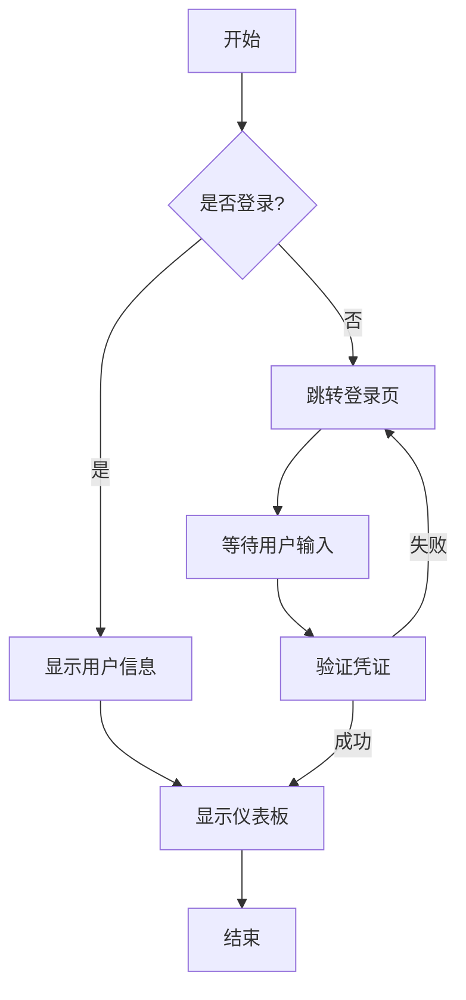
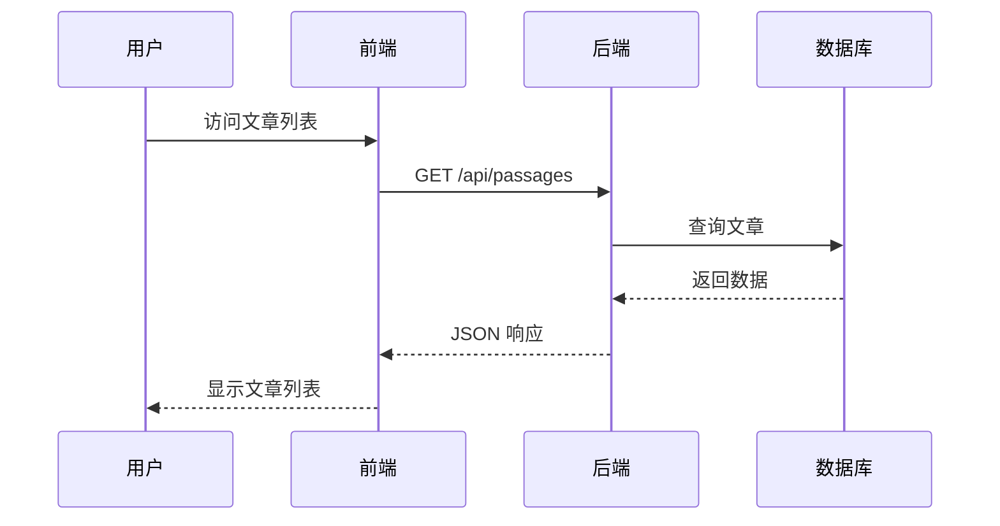
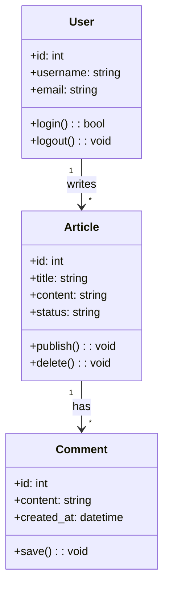
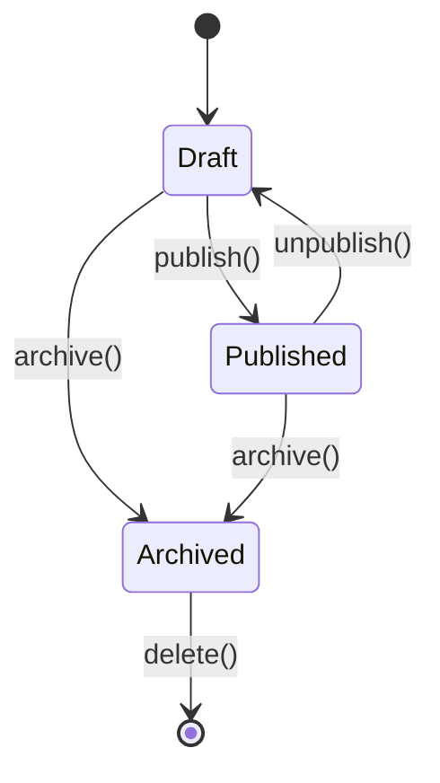

# 代码块和流程图测试

## 代码块测试

### Python 代码

```python
def fibonacci(n):
    """计算斐波那契数列"""
    if n <= 1:
        return n
    return fibonacci(n-1) + fibonacci(n-2)

# 打印前10个斐波那契数
for i in range(10):
    print(f"F({i}) = {fibonacci(i)}")
```

### JavaScript 代码

```javascript
// 计算数组的平均值
function calculateAverage(numbers) {
    const sum = numbers.reduce((acc, num) => acc + num, 0);
    return sum / numbers.length;
}

const data = [10, 20, 30, 40, 50];
console.log(`平均值: ${calculateAverage(data)}`);
```

### Rust 代码

```rust
fn main() {
    let numbers = vec![1, 2, 3, 4, 5];
    let sum: i32 = numbers.iter().sum();
    println!("总和: {}", sum);
}
```

## 流程图测试

### 流程图示例



### 序列图示例



### 类图示例



### 状态图示例

